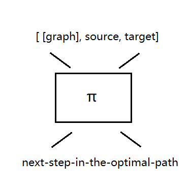
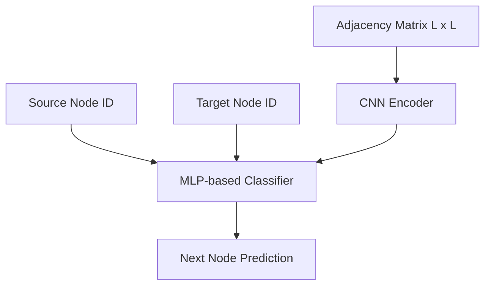

# DLSPP — Deep Learning Shortest Path Problem

After learning fundamental data structures, we know that the shortest path problem in graphs can be efficiently solved using classical algorithms such as Dijkstra’s algorithm. While these methods are mathematically elegant and computationally optimal, we are interested in exploring whether the shortest path problem can also be approached from a learning-based perspective, mimicking an intuitive decision-making process rather than explicit algorithmic computation.

This leads to potential methods in machine learning for graph reasoning.

The first challenge is how to represent a graph in a format suitable for neural networks. We adopt the adjacency matrix representation, which encodes a graph with L nodes into a fixed-size L<sup>2</sup> tensor.

The second challenge is how to let the model know the source and target nodes, and how to make the model output the optimal path. We append the source and target nodes to the input tensor. Given this input, the model is trained to predict the optimal next node in the current state, i.e., the next step along the shortest path. It is easy to prove that if a model can correctly infer the optimal next step from any given state, then it can generate the entire shortest path.

<p align="center">
  
</p>

For example, let **π** be the model, and **G** the input graph, and **[a, b, c, d]** the optimal path. Then:
$$
π(G, a, d) = b 
$$
Next, use the optimal next step 'b' as current node:
$$
π(G, b, d) = c 
$$
Repeat it:
$$
π(G, c, d) = d
$$
By repeatedly applying π, the full optimal path **[a, b, c, d]** can be recovered.

Therefore, our current task can be simplified to designing a model that takes a graph G, a source, and a target as input, and predicts the next node on the optimal path.


## Model 

Our model consists of a CNN backbone followed by an MLP head. The CNN processes the adjacency matrix (reshaped as a 2D grid) through multiple Conv–SiLU–Conv–SiLU–MaxPool blocks and a final convolution layer to extract structural features. The resulting features are flattened and concatenated with the source and target node IDs. The combined representation is passed through an MLP, where the final linear layer performs node classification to predict the next node in the shortest path.



## Data Generator

When it comes to training data, we first randomly generate a **fully connected weighted directed graph** with **L** nodes, where each edge weight is independently sampled from a discrete uniform distribution $[1,M]$. We then randomly select a source node and a target node. The shortest path between them is computed using Dijkstra’s algorithm to serve as supervision. The model is trained to predict the optimal next step, i.e., the immediate successor of the source node along the shortest path to the target.

There is a demo:
```python
def generate_random_adjacency(L,M):
    pass

def dijkstra(adj, start, end):
    pass

class OurDataset:
    def __getitem__(self, index):
        start, end = random.sample(range(L), 2)
        adj = generate_random_adjacency(L,M)
        path = dijkstra(adj, start, end)

        question = [val for row in adj for val in row] + [start, end]
        question = torch.tensor(question, dtype=torch.float32)
        answer = torch.tensor(path[1], dtype=torch.float32)

        return question, answer
```

Unlike conventional machine learning settings with fixed datasets, our data can be generated on the fly, allowing for effectively unlimited training samples. Therefore, the notion of an epoch becomes less meaningful in our setting.


-----------------
This is an experimental personal project. The code is incomplete and may not work properly.